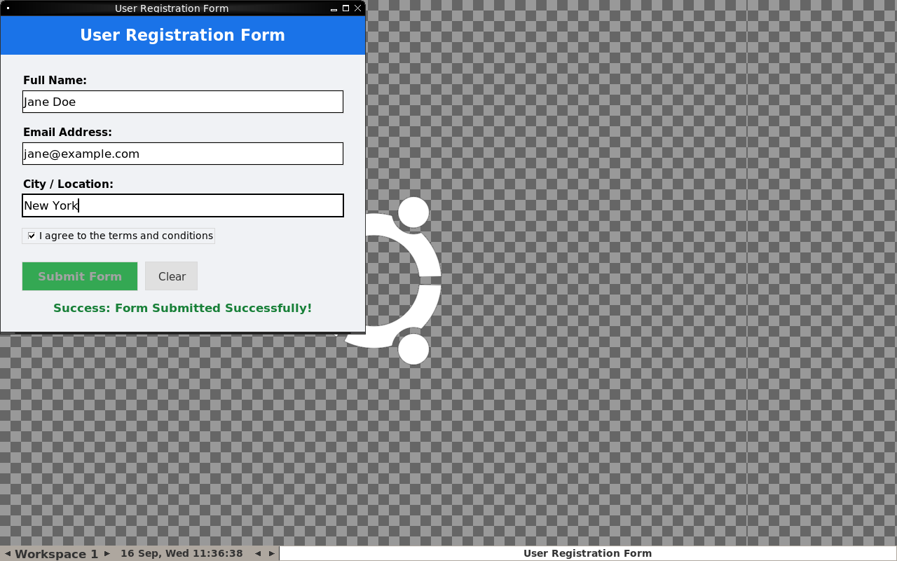
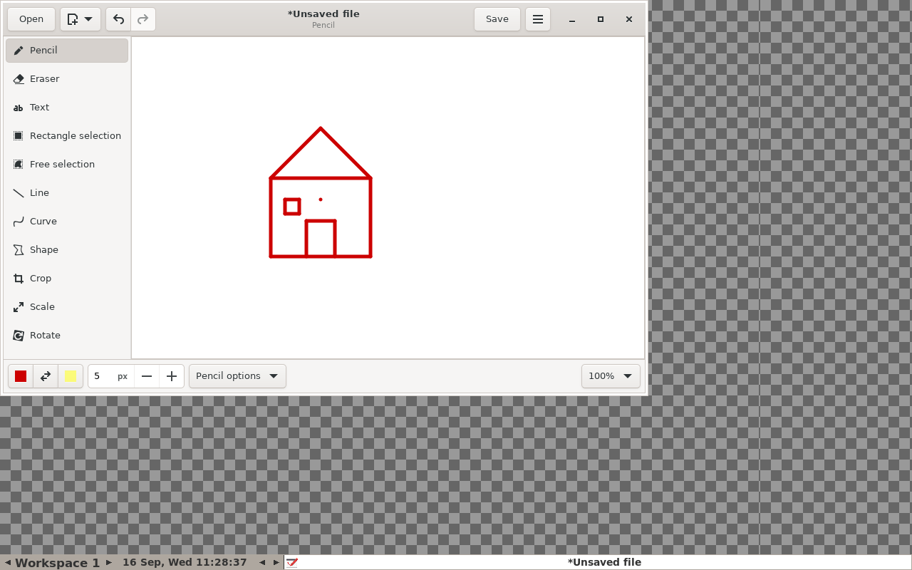

# Local Computer-Use Agent

**Architect: SAKSHAM SWAMI**

A free, fully **offline** computer-use agent: a local vision-language model
(via [Ollama](https://ollama.com) — `qwen3-vl`, `minicpm-v4.6`) watches the
screen and drives real mouse/keyboard actions to complete a task, end to end,
with no cloud API and no per-action cost.

This is the same category of system as **Anthropic's Claude Computer Use**,
**OpenAI's Operator / ChatGPT Atlas**, and **Google's Project Mariner** — an
LLM that can see a screen and operate a real desktop or browser — except it
runs entirely on your own machine against small, local, free models instead
of a hosted frontier model. The bet here: small local VLMs are bad at raw
pixel-coordinate prediction, but that's a solvable *grounding* problem, not a
model-size problem — so this project focuses almost entirely on the
scaffolding that makes a small model's job trivial instead of trying to make
the model itself smarter.

## See it work

| Filling a form | Drawing a house |
|---|---|
|  |  |

Full screen recordings of both runs, **fully autonomous, unedited**:

- [`videos/form_filling_demo.mp4`](videos/form_filling_demo.mp4) — launches a
  Tkinter registration form from a bare desktop, grounds and fills Name /
  Email / City, checks the terms checkbox, and submits.
- [`videos/drawing_demo.mp4`](videos/drawing_demo.mp4) — launches GNOME
  Drawing, focuses the canvas, and draws a house (roof, walls, door, window)
  via smooth interpolated drag strokes.

The form run's exact output, written by the agent's own click on Submit:
[`docs/example_form_submission.json`](docs/example_form_submission.json).

## Why small local models need help that big API models don't

Frontier computer-use models (Claude, GPT) are trained specifically to
predict screen coordinates directly. Small local models (`qwen3-vl`,
`minicpm-v4.6`, `gemma4` — the kind that run on a single consumer GPU, for
free, forever) are not, and asking them for a raw `(x, y)` pixel guess on a
1280×800 screenshot is close to a coin flip. So instead of fighting that,
this project never asks a small model for a coordinate at all:

### 1. Set-of-Marks (SoM) grounding, not pixel prediction
Every clickable element gets a distinct, numbered, high-contrast badge
`[1]`, `[2]`, `[3]`… drawn directly on the screenshot. The model's entire
output for an interaction is `{"action": "click_mark", "mark": 9}` — an
integer, not a coordinate. The framework — not the model — translates mark
`[9]` back to an absolute desktop `(cx, cy)` and fires the real `xdotool`
click. (Same idea as Microsoft's OmniParser, applied with OpenCV contour
detection instead of a second detector model.)

### 2. Crop-zoom & super-resolution before the model ever sees the screen
A full 1280×800 (or 1080p) screenshot degrades small buttons and text into a
handful of blurry pixels once a small vision encoder downsamples it.
[`vision_zoom.py`](vision_zoom.py) detects the region of interest containing
the active UI (via OCR + OpenCV contour boxes in [`ocr.py`](ocr.py)), crops
to just that region, and upscales it 2× with bicubic interpolation *before*
drawing the SoM badges — so the model sees a magnified, legible close-up of
exactly the area it needs to act on, never the whole noisy desktop.

### 3. Step subdivision, not one giant prompt
A task is first broken into 2–3 ordered milestone states (`app open` →
`fields filled` → `submitted`) rather than handed to the model as one
open-ended instruction. The decision prompt only ever shows the *current*
subtask, so a small model isn't asked to plan and execute simultaneously —
one job per turn (an idea shared with Agent-S and Browser-Use).

### 4. File-based structured memory, not a growing chat transcript
Small models reason poorly over long conversation history. Instead, every
step logs a compact `action → expected → observed → guidance` record to a
flat file ([`memory.py`](memory.py)); the next decision prompt reads only
that compact log, never a replayed transcript. Repeated failures trigger a
dedicated "diagnose and recover" prompt rather than silently looping forever.

### 5. OS-level grounding as an anti-hallucination check
Before every decision, the real window manager is queried (`xdotool` window
titles) for what's actually open. If the model claims to see a form that
isn't in that list, the action is corrected rather than trusted — a small
but important guard against a vision model confidently describing something
that isn't on screen.

## Two runtimes

- **`agent_sandbox.py`** — the full system above, running inside an
  isolated, disposable Ubuntu + Xvfb + fluxbox sandbox (`sandbox/`, viewable
  live over noVNC), with drawing primitives and structured form-filling
  built in. This is what the demo videos were recorded from.
- **`agent.py`** — a minimal, dependency-light variant that drives your
  **real Windows desktop directly** via `pyautogui` (no sandbox, no OpenCV
  grounding pipeline) against `minicpm-v4.6` — the simplest possible version
  of "local model watches screen, clicks things."

## Try it

Requires [Ollama](https://ollama.com) running locally with a vision model
pulled (`ollama pull qwen3-vl` or `ollama pull minicpm-v4.6`).

**Sandboxed (recommended — isolated, recordable, includes the demo apps):**
```bash
cd sandbox
docker build -t local-computer-use-sandbox .
docker run -d -p 6080:6080 -e TASK="fill out the registration form" \
  --name cua local-computer-use-sandbox
# watch live at http://localhost:6080/vnc.html
```

**Direct on your own desktop (Windows, no Docker):**
```bash
pip install pyautogui requests
python agent.py "open notepad and type hello world"
```

Record your own run of a sandboxed task to `.mp4`:
```bash
docker exec cua python3 /agent/../record_task.py "your task here" /tmp/out.mp4
docker cp cua:/tmp/out.mp4 ./out.mp4
```

## Layout

| Path | Responsibility |
|---|---|
| [`agent_sandbox.py`](agent_sandbox.py) | Full agent loop: plan → decide → act → reflect → (recover), sandbox runtime |
| [`agent.py`](agent.py) | Minimal direct-desktop variant (Windows, pyautogui, no sandbox) |
| [`vision_zoom.py`](vision_zoom.py) | Crop-zoom, super-resolution, Set-of-Marks badge rendering |
| [`ocr.py`](ocr.py) | UI panel/widget detection (OCR + OpenCV contours) feeding the zoom ROI |
| [`memory.py`](memory.py) | Flat-file step log + cross-run task history |
| [`sandbox/`](sandbox/) | Dockerfile, entrypoint, and the two bundled demo apps (`form_app`, GNOME `drawing`) for a fully reproducible, disposable test environment |
| [`videos/`](videos/) | Unedited screen recordings of full autonomous runs |
| [`docs/`](docs/) | Result screenshots + example output referenced above |

## Disclaimer

Research/portfolio build for a personal machine. Not hardened for
untrusted tasks or multi-tenant use — the agent can click and type anything
an operator prompt tells it to, so only point it at a sandbox or a machine
you control.
